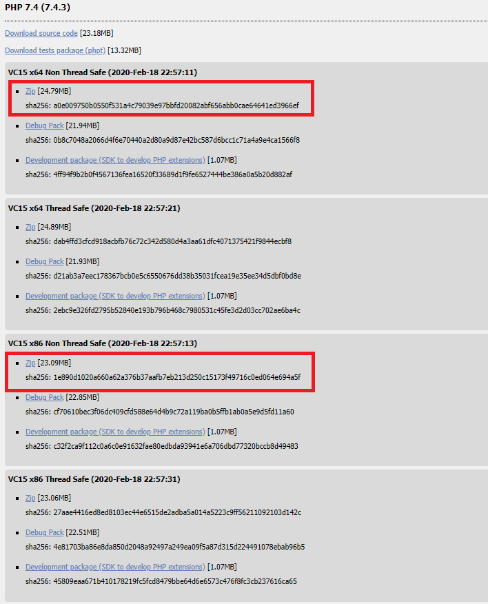
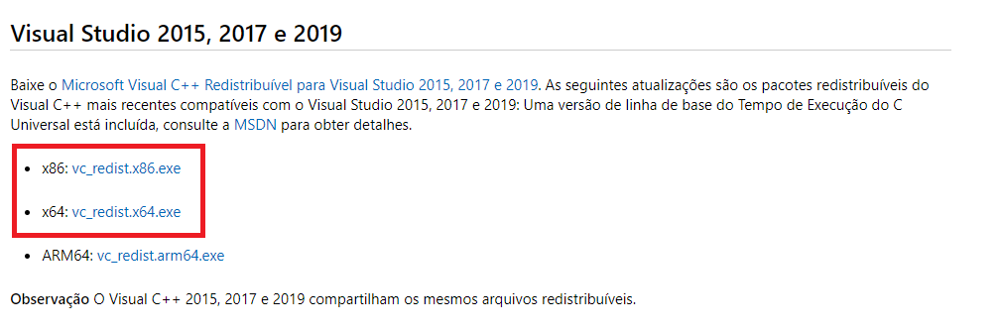
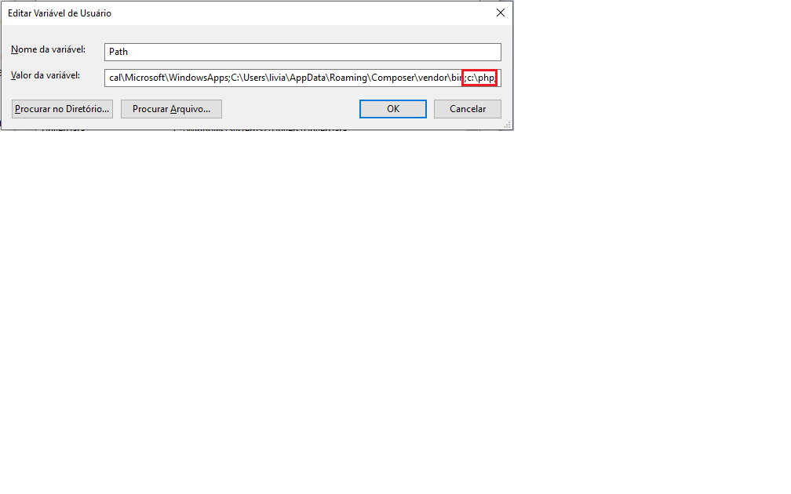
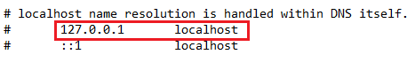

# Instalação

## Linux
Instalar o PHP no Linux é muito simples! Você deve primeiro abrir o terminal. Para isso você pode pesquisar nos seus programas instalados ou se preferir com o seguinte atalho:
ctrl + alt + t

Com o terminal aberto digite:

```bash
sudo apt install php
```
###### Obs.: em um sistema baseado em Debian usa-se apt para instalar pacotes.  

Desta forma o PHP será instalado no seu computador.

Para conferir a versão instalada digite:

```bash
php -v
```
  
Pronto! O PHP está pronto para ser utilizado.

## MAC
Instando PHP no MAC - via Macports

O projeto MacPorts é uma iniciativa da comunidade de código aberto para projetar um sistema fácil de usar para compilar, instalar e atualizar softwares por linha de comando.

Você pode instalar o php em diferentes versões : php5.4, php5.5, php5.6, php7.0, php7.1, php7.2 ou php7.3 usando o comando port install, como no exemplo abaixo:

```bash
sudo port install php56
sudo port install php73
```

Você pode utilizar o comando select para trocar a versão ativa do PHP:

```bash
 sudo port select --set php php73
```

## Windows

### Download do PHP

Acesse https://windows.php.net/download/ e faça o download da versão mais recente do PHP correspondente para seu Window (x86 ou x64). Existem versões: *Thread Safe(TS)* ou *Non Thread Safe(NTS)*. Isso diz respeito a questões internas do PHP, mas para desenvolvimento escolha a *Non Thread Safe(NTS)*. 

<kbd>

</kbd>


Após o download, descompacte o arquivo *.zip* na partição principal do seu computador (normalmente *C:*) e renomeie a pasta para simplesmente *php*.

### Download e instalação Microsoft Visual C++

Será preciso também fazer o dowload e instalação da últmia versão do *Microsoft Visual C++* (o PHP precisa dele para ser executado em Windows). Acesse https://support.microsoft.com/pt-br/help/2977003/the-latest-supported-visual-c-downloads e faça o download da versão mais recente do *Visual C++* correspondente para seu Window (x86 ou x64).

<kbd>

</kbd>

### Configurações do PHP

Para o PHP funcionar corretamente, precisamos ativar suas configurações padrões. Dentro da pasta descompactada no *C:* existem dois arquivos de configurações: *php.ini-development* e *php.ini-production*. Estes dois arquivos apresentam configurações para rodar o PHP em modo de produção (mais adequado quando se hospeda uma aplicação em um servidor na internet) ou em modo desenvolvimento que é adequado para se desenvolver aplicações PHP, pois com isso ativamos o controle de erros e debug da aplicação. Como estamos em ambiente de desnvolvimento renomeie o arquivo *php.ini-development* para somente *php.ini*.

### Variáveis do sistema

Agora vamos editar as variáveis do sistema para a pasta do php ser encontrada. Abra o *Painel de Controle*, vá em *Sistema*, selecione a guia *Avançado*, depois clique em *Variáveis de ambiente*. Na seção *Variáveis do sistema*, selecione *Path* e clique em *Editar*. Em *Valor da variável*, vá até o final do campo de texto, agora iremos colocar o caminho onde o nosso PHP está, acrescente antes um ; (ponto e vírgula) para finalizar os caminhos anteriores e coloque *c:\php*,. Clique em *Ok* em todas as janelas para confirmar a alteração.

<kbd>

</kbd>

### Arquivo hosts
Agora temos que configurar o arquivo de hosts para apontar o nome *localhost* para *127.0.0.1*.

Abra vá até a pasta *C:\Windows\System32\drivers\etc* e abra o arquivo *hosts* com um editor de texto. Agora verifique se existe a linha *127.0.0.1       localhost*, se existir está pronto, senão acrescente-a ao final do arquivo, salve e feche o programa.

<kbd>

</kbd>

Reinicie sua máquina.

Abra o terminal de sua preferência e digite:

```bash
php --version
```

Se logo em seguida você ver uma mensagem com a versão do PHP instalada, então ocorreu tudo bem.

[Voltar a página inicial](../README.md)
