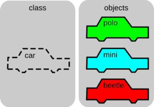
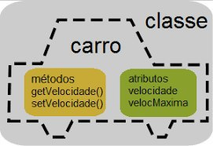
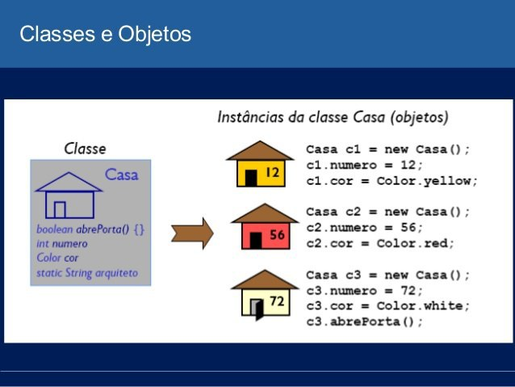

# Orientação a Objetos

## Classes e Objetos
Uma classe é uma forma de definir um tipo de dado em uma linguagem orientada a objetos. Ela é formada por dados e comportamentos.
Com a classe definida, podem ser criados diversos objetos do tipo da classe criada. Ela funciona, então, como um modelo para a criação dos seus objetos.

Objetos são instâncias de classes, que determinam qual informação um objeto contém e como ele pode manipulá-la. É uma entidade capaz de reter um estado (informação) e que oferece uma série de informações (comportamento) para examinar ou para afetar este estado. É através deles que praticamente todo o processamento ocorre em sistemas implementados com linguagens de programação orientadas a objetos.

<kbd>

</kbd>

## Atributos e métodos
Para definir os dados são utilizados os atributos, e para definir o comportamento são utilizados métodos.

<kbd>

</kbd>

Atributos de uma classe também são conhecidos como propriedades e descrevem um intervalo de valores que as instâncias da classe podem apresentar.
Um atributo é uma variável que pertence a um objeto. Os dados de um objeto são armazenados nos seus atributos.
Informações sobre o objeto. Dados que posso armazenar.

Os métodos são procedimentos ou funções que realizam as ações próprias do objeto. Assim, os métodos são as ações que o objeto pode realizar. Tudo o que o objeto faz é através de seus métodos, pois é através dos seus métodos que um objeto se manifesta, através deles que o objeto interage com os outros objetos.
Sendo mais conhecidos como: Método Construtor, Métodos Get e Set, etc.

######## Faremos um exemplo na aula que será incluído aqui

<kbd>

</kbd>

## Visibilidade

São distribuídas em três tipos, private (privado), public (publico) e protect (protegido):
- Privado: uma função local e um único bloco de código
- Público: visível para tudo uma função a ser chamada a qualquer momento
- Protegido: esse caso restringe o parâmetro fora da classe, mas ainda acessível às suas subclasses (herança)

######## Faremos um exemplo na aula que será incluído aqui

## Encapsulamento

O conceito do encapsulamento consiste em "esconder" os atributos da classe de quem for utilizá-la. Isso se deve por dois motivos principais.
Um é para que alguém que for usar a classe não a use de forma errada o outro motivo é de manter todo o código de uma determinada classe encapsulada dentro dela mesmo.

Encapsulamento vem de encapsular, que em programação orientada a objetos significa separar o programa em partes, o mais isolado possível. A idéia é tornar o software mais flexível, fácil de modificar e de criar novas implementações. O Encapsulamento serve para controlar o acesso aos atributos e métodos de uma classe. É uma forma eficiente de proteger os dados manipulados dentro da classe, além de determinar onde esta classe poderá ser manipulada

######## Faremos um exemplo na aula que será incluído aqui

## Associação de Classes

Uma associação define um relacionamento entre duas classes que permite que um objeto faça com que outro objeto realize uma ação em seu lugar.

Em termos gerais, a casualidade da ação é feita ao enviar uma mensagem ou invocar um método do objeto controlado.

######## Faremos um exemplo na aula que será incluído aqui
